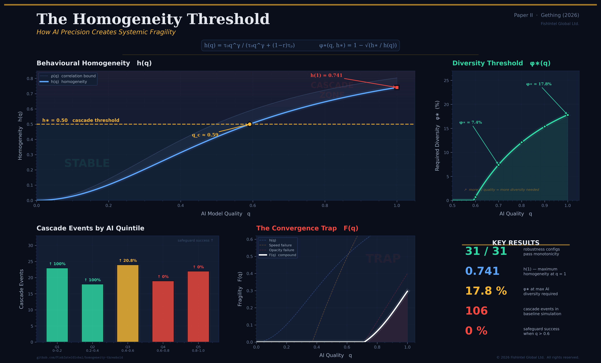

# The Homogeneity Threshold

**How AI Precision Creates Systemic Fragility**

Paper II in the Applied Probabilistic Systems Series

Jason Gething · FishIntel Global Ltd. · February 2026

---



## Core Result

Improving AI accuracy in adaptive systems monotonically increases the probability of catastrophic cascade failure:

    h(q) = τ₀q^γ / (τ₀q^γ + (1−r)τₚ)

The critical diversity threshold required to prevent cascade:

    φ*(q, h*) = 1 − √(h* / h(q))

## Key Findings

- **31/31** robustness configurations pass monotonicity
- **h(1) = 0.741** — maximum homogeneity at full AI quality
- **φ* = 17.8%** — diversity required at maximum AI quality
- **0%** safeguard success when q > 0.6
- **106** cascade events in baseline simulation (N=1,000, T=10,000)

## Reproduce the Figure
```bash
pip install numpy matplotlib
python generate_paper_ii_hero.py
```

## Citation

Gething, J. (2026b). *The Homogeneity Threshold: How AI Precision Creates Systemic Fragility*. FishIntel Global Working Paper.

## Series

- **Paper I**: [Uncertainty Axioms](https://github.com/FishIntelGlobal/uncertainty-axioms) (Gething, 2026a)
- **Paper II**: The Homogeneity Threshold (this repo)
- **Paper III**: Forthcoming

## License

MIT
